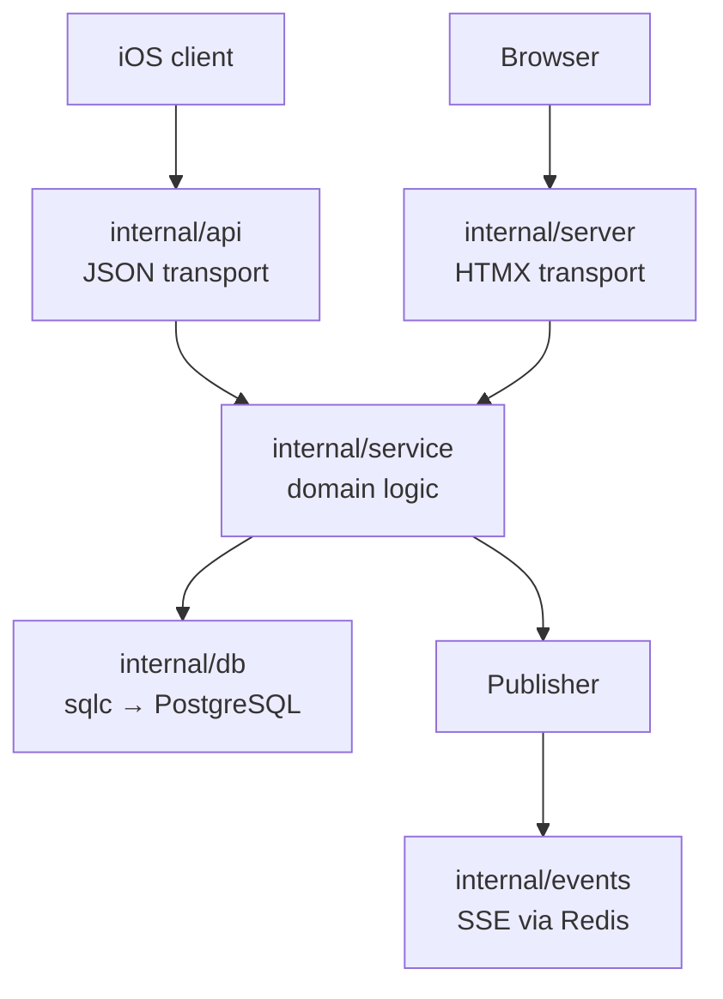

# Architecture Overview

Contributor-facing documentation for the groceries server. Each article is
short and focused on one concern; start here and follow the links.

## The big picture

The server has **two transports** sharing **one domain layer**:

- **`internal/api`** — token-authenticated JSON API under `/api/v1/`, consumed
  by the iOS client. Handlers only parse requests, call the service, and
  serialize JSON.
- **`internal/server`** — cookie-authenticated HTMX web UI. Handlers only
  parse forms, call the service, and render templates/redirects.
- **`internal/service`** — all business logic: validation, permission checks,
  DB call sequencing, transactions, and event publishing. See
  [Service Layer](architecture/service-layer.md).
- **`internal/db`** — PostgreSQL access. Queries are written in
  `internal/db/queries/*.sql` and generated by sqlc into
  `internal/db/models`. There is no handwritten model package. See
  [Data Layer](architecture/data-layer.md).
- **`internal/authz`** — shared credential resolution for both transports
  (API tokens and web sessions, both stored in Redis). See
  [Authentication](architecture/authentication.md).
- **`internal/events`** — Redis-backed pub/sub powering Server-Sent Events.
  See [Realtime Events](architecture/realtime-events.md).

## Articles

| Article | What it covers |
|---------|----------------|
| [Service Layer](architecture/service-layer.md) | The shared domain package: error contract, transactions, where to add new logic |
| [Data Layer](architecture/data-layer.md) | sqlc workflow, adding queries, migrations |
| [Adding an Endpoint](architecture/adding-an-endpoint.md) | Step-by-step checklist for a new feature across both transports |
| [Authentication](architecture/authentication.md) | Tokens vs sessions, middleware, login/logout lifecycle |
| [Realtime Events](architecture/realtime-events.md) | SSE channels, what publishes what, how to add an event |

## Invariants worth knowing

1. **Handlers contain no business logic.** If you're writing a SQL call,
   validation rule, or permission check in `internal/api` or
   `internal/server`, it belongs in `internal/service` instead.
2. **The web server never HTTP-calls the API.** Both transports import the
   service package directly. (There used to be an `internal/client` self-call
   layer; it was removed.)
3. **Event names live in `internal/service`** (`EventList`, `EventCart`,
   `EventCategory`). Don't define event-name constants elsewhere.
4. **Domain errors are sentinel errors** classified with `errors.Is` and
   mapped to status codes by each transport — the service never imports
   `net/http`.
